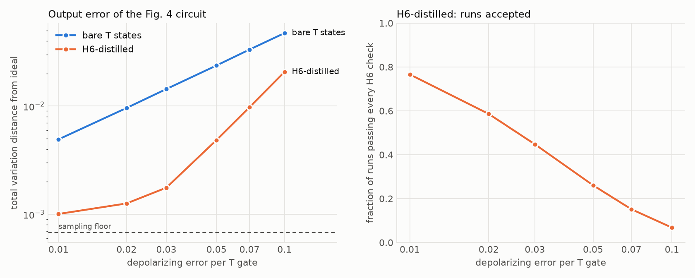

# Pauli-Product-QC-Demo

A working simulation of Pauli product quantum computation. It takes the example
circuit from Litinski's "A Game of Surface Codes"
([arXiv:1808.02892](https://arxiv.org/abs/1808.02892), Fig. 4), compiles it to
Pauli product measurements, and runs it with one magic state per T gate. The magic
states come from the `[[6,2,2]]` H6 distillation protocol
([arXiv:2506.14688](https://arxiv.org/abs/2506.14688)) built by LightStim, and the
non-Clifford gates are simulated exactly with [Clifft](https://github.com/unitaryfoundation/clifft).



With depolarizing noise on every T gate, H6-distilled magic states give a lower
output error than bare T states at every noise level tested, at the cost of
discarding runs. At 1% noise per T gate the error drops from 0.0049 to 0.0010 (close
to the sampling floor of 0.0007) with 77% of runs accepted.

## Run it

```bash
python3 -m venv .venv
.venv/bin/pip install -e ".[test]"
.venv/bin/python demo.py          # about a minute; writes results.png
.venv/bin/pytest
```

`pip install` pulls LightStim over SSH from the pinned commit described below. To use
a local checkout instead, run `.venv/bin/pip install -e /path/to/LightStim` and then
`.venv/bin/pip install -e . --no-deps`.

The same pipeline as a step-by-step walkthrough, with outputs saved, is in
[`notebooks/pauli_product_qc.ipynb`](notebooks/pauli_product_qc.ipynb). To rerun it,
install with `".[notebook]"` and open it in Jupyter; it takes about five minutes.

## What the demo does

1. **Write the circuit as Pauli rotations.** `ppqc.litinski_fig4()` is the paper's
   4-qubit circuit: 21 rotations `exp(-i φ P)`, of which 4 are π/8 (T gates) and the
   rest are π/4 (Clifford).
2. **Commute the Cliffords out.** `ppqc.compile_to_ppm` moves every π/4 rotation to
   the end and absorbs it into the final measurements. The result matches the paper's
   figure:

   | | |
   |---|---|
   | π/8 rotations (one layer) | `+Z___`, `+_XY_`, `-___Y`, `-ZZZY` |
   | measurements replacing Z on q1..q4 | `+YZZY`, `+XX__`, `-__Z_`, `+X__X` |

3. **Turn each rotation into measurements.** A π/8 rotation about `P` consumes one
   magic state: measure `P` jointly with the magic state, then measure the magic
   state in X. The two outcomes decide a Clifford correction and a Pauli correction,
   and neither is applied as a gate. They change which Pauli products are measured
   later and how the outcomes are read.
4. **Sample it.** `ppqc.run` executes the measurement sequence on Clifft and compares
   the output distribution with the original circuit's.

## How the magic states are made

`ppqc.BareMagic` prepares `T|+⟩` on one physical qubit.

`ppqc.H6Magic` calls `lightstim.protocols.h6_distillation.build_h6_distillation_circuit`
and turns its circuit into the real protocol. LightStim builds a Clifford proxy,
because Stim cannot hold a magic state. Clifft can, so the proxy is reversed:

| LightStim proxy | Here |
|---|---|
| encoder inputs in `\|+⟩` | encoder inputs in `\|H+⟩`, one T gate each |
| CX from the Bell-check ancillas | controlled-H, two T-type gates each |
| final transversal MX readout | kept: it is the X measurement that discards the two magic states |

Each block yields two magic states and uses 14 T-type gates. A state is consumed by
measuring `P ⊗ Y_L` directly on the block (`Y_L` is the weight-3 operator `Y Y Y` on
the slot's support), since `|H+⟩` lies in the XZ plane. Runs are discarded if any
LightStim detector fires.

One addition to the LightStim circuit matters. The proxy ends in an X readout, which
cannot see X errors on the data qubits. A real magic state is consumed through
`Y_L`, which can. `H6Magic` therefore repeats LightStim's syndrome extraction round
once after the H check and post-selects on it. Without that round the output error
stays first order in the T-gate noise and is no better than with bare states
(`post_check_rounds=0` reproduces this). With it the error is second order.

## Read this before using the results

- **Data qubits are ideal.** The four logical qubits are bare, noiseless qubits.
  Only the magic states are simulated at the physical level.
- **The joint measurements are ideal.** `P ⊗ Y_L` is a single noiseless `MPP`, not a
  lattice-surgery or ancilla-based measurement.
- **Noise is on T gates by default.** `--p` adds LightStim's circuit-level noise to
  the Clifford operations of the H6 block. With it, an X error after the last
  syndrome round is not caught, so the error is no longer suppressed to second order.
- **The metric is coarse.** The Fig. 4 circuit has a random output, so there is no
  single logical observable to flip. The demo reports total variation distance from
  the ideal distribution, which has a sampling floor near 0.0007 at the default
  shot count. The floor rises as fewer runs are accepted, so the H6 points at low
  noise are upper bounds. `tests/test_execute.py` checks the scaling on a
  one-qubit program with a deterministic answer, which has no floor.
- **Branches are post-selected, not fed forward.** Clifft compiles a circuit once
  and cannot change measurement bases mid-shot. Each of the 16 patterns of Clifford
  corrections is compiled as its own circuit and post-selected on that pattern. The
  accepted shots together are exactly the shots of the adaptive protocol.
- **No twirl.** The paper's randomized twirl before consuming a checked state is not
  implemented.

## LightStim version

The H6 distillation protocol is not on `QuTone/LightStim` main. Main has the H6 code
and encoder; the protocol is in open PR #108 from
`maggie-bao202/LightStim@feat/h6-distillation-protocol`. `pyproject.toml` pins commit
`a73ed05` of that branch. Switch the dependency to `QuTone/LightStim` main when the
PR merges.

## Layout

| File | Contents |
|---|---|
| `ppqc/compiler.py` | Pauli rotations, Clifford commutation, T layers |
| `ppqc/circuits.py` | the Fig. 4 circuit |
| `ppqc/magic.py` | bare and H6 magic state sources |
| `ppqc/execute.py` | the rotation gadget, correction tracking, Clifft sampling |
| `ppqc/reference.py` | dense statevector reference used for checking |
| `demo.py` | the end-to-end run and plot |
| `notebooks/pauli_product_qc.ipynb` | the pipeline, step by step |
